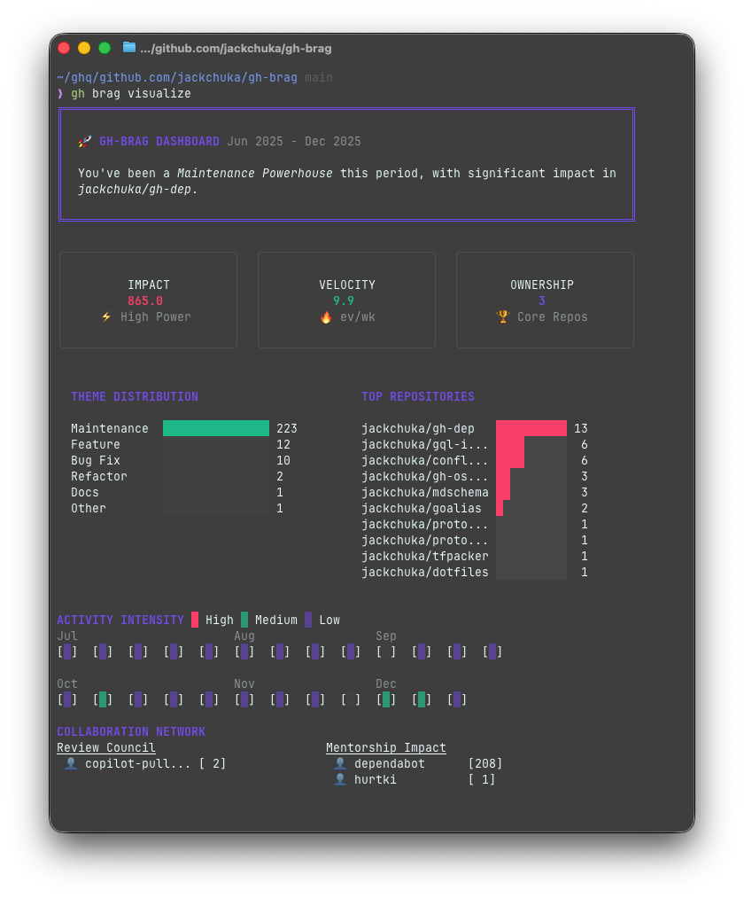

# 🚀 gh-brag

[](https://github.com/jackchuka/gh-brag/actions)
[](https://goreportcard.com/report/github.com/jackchuka/gh-brag)

**gh-brag** is a GitHub CLI extension designed to help you aggregate your engineering impact for performance reviews, brag docs, or personal retrospectives. It scans your GitHub activity (PRs, Issues, Reviews), analyzes it for high-value insights, and presents it in a Terminal UI (TUI) dashboard.



---

## ✨ Features

- **📝 Daily Reports**: Generate standup-ready reports of your GitHub activity with optional AI summarization.
- **🤖 LLM Summarization**: Use GitHub Models API to create concise, themed summaries in any language.
- **🎯 Impact Scoring**: Automatically calculates an "Impact Score" based on weighted actions and thematic focus.
- **📊 TUI Dashboard**: A stunning terminal interface showing:
  - **Theme Distribution**: See where you're spending your time (Feature, Refactor, Bugfix, etc.).
  - **Activity Intensity**: A sleek heatmap of your contributions over time.
  - **Top Repositories**: Identify where you've had the most significant presence.
- **🤝 Collaboration Network**: Visualize your "Review Council" (who reviews you) and your "Mentorship Impact" (who you review).
- **🔧 Customizable**: Flexible theme and metric configuration.

---

## 🔍 Theme Matching

`gh-brag` theme matching order:

1. **Labels First (Priority)**: Searches the PR/Issue's labels that contain theme keywords.
2. **Title Fallback (First Appearance)**: Searches the PR/Issue title for theme keywords. The theme with the keyword appearing **earliest** (lowest index) in the title wins.

---

## 📦 Installation

Install as a `gh` extension:

```bash
gh extension install jackchuka/gh-brag
```

---

## 🛠 Usage

### Daily Report

Generate a quick daily standup report of your GitHub activity:

```bash
gh brag daily
```

Options:

- `--date 2026-01-07` - Report for a specific date
- `--from 2026-01-01 --to 2026-01-07` - Report for a date range
- `--format plain|json|yaml` - Output format (default: plain)
- `--org mycompany` - Filter by organization (repeatable)

#### LLM Summarization

Generate an AI-powered summary using GitHub Models:

```bash
gh brag daily --summarize
gh brag daily --summarize --summarize-lang ja # Japanese
gh brag daily --summarize --summarize-prompt "be formal"
```

Summarization options:

- `--summarize` - Enable LLM summary
- `--summarize-lang en|ja|...` - Output language (default: en)
- `--summarize-model openai/gpt-4o` - Model to use
- `--summarize-prompt "..."` - Additional instructions

### Collect & Visualize

For longer-term analysis, collect your activity and visualize it:

#### 1. Collect your activity

Gather your GitHub events for a specific period. By default, it looks at the last 6 months.

```bash
gh brag collect
```

_Creates `gh-brag.events.jsonl` containing your raw activity._

#### 2. Visualize your impact

Launch the TUI dashboard to explore your insights.

```bash
gh brag visualize
```

---

## 🔍 Advanced Usage

### Customizing the Period

```bash
gh brag collect --from 2024-06-01 --to 2024-12-31
```

### Exporting a YAML Report

If you need a raw data report for your records:

```bash
gh brag analyze --out my-report.yaml
```

---

## ⚙️ Configuration

Customize the analysis by providing a `config.yaml` file. You can adjust theme keyword mappings and impact weights.

```yaml
themes:
  - name: "Feature"
    keywords: ["feat", "feature", "new", "implement"]
  - name: "Refactor"
    keywords: ["refactor", "cleanup", "refactor"]

metrics:
  ownership_threshold: 5 # Min PRs to be considered an 'Owner'
  action_weights:
    merged: 10.0
    reviewed: 5.0
    authored: 2.0
```

Run with your config:

```bash
gh brag --config my-config.yaml visualize
```

---

## 🧰 Tech Stack

- **Go**: Core logic and performance.
- **Cobra**: CLI framework.
- **Lipgloss / Charmbracelet**: Beautiful terminal UI components.
- **GitHub API (via go-gh)**: Reliable data collection.

---

## 📄 License

MIT License - see [LICENSE](LICENSE) for details.
